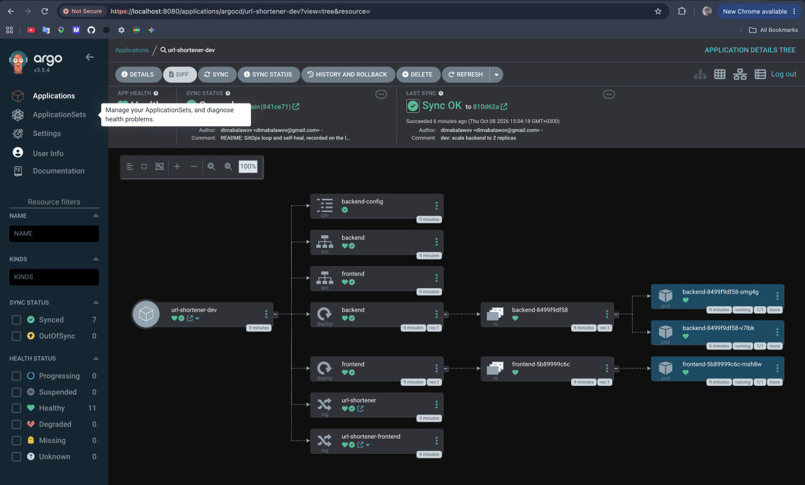

# url-shortener-gitops

Desired state of the url-shortener in Kubernetes. ArgoCD, running inside the
cluster, watches this repo and makes the cluster match it.
**Deploying means `git push`;** nobody runs `helm` or `kubectl` to deploy.

The cluster itself (AWS, k3s, RDS, Cloudflare, ArgoCD install, Secrets) lives
in [url-shortener-infra](https://github.com/balawovdima-dev/url-shortener-infra).

## Layout

```
apps/
  dev.yaml        Application url-shortener-dev  -> namespace url-shortener-dev
  prod.yaml       Application url-shortener-prod -> namespace url-shortener-prod
charts/url-shortener/
  values.yaml       defaults
  values-dev.yaml   https://dev.supabase.win, 1 replica each
  values-prod.yaml  https://supabase.win, 2 replicas each
```

The `root` Application (installed once by the infra bootstrap script) syncs the
`apps/` folder ("app of apps"). Each environment Application renders the chart
with `values.yaml` + its `values-<env>.yaml`. Every Application is set to
`automated: {prune: true, selfHeal: true}`:

- a change on `main` reaches the cluster without anyone running a command
  (ArgoCD polls git every ~3 minutes);
- something deleted from git is deleted from the cluster;
- a manual change in the cluster is reverted to what git says.

| Change                      | How                                            |
|-----------------------------|------------------------------------------------|
| Deploy / scale / configure  | edit `charts/url-shortener/values-<env>.yaml`, push |
| Change the chart            | edit `charts/url-shortener/templates`, push (both envs) |
| Add an environment          | add `apps/<env>.yaml` + `values-<env>.yaml`, push (its namespace and Secrets come from the infra bootstrap) |
| Roll back                   | `git revert`, push                             |

Secrets (`DATABASE_URL`, the Cloudflare Origin cert) are not in git. The infra
bootstrap creates them in each namespace from `terraform output`.

## The GitOps loop

Scaling dev's backend from 1 to 2 replicas is a one-line commit
([810d62a](https://github.com/balawovdima-dev/url-shortener-gitops/commit/810d62a)):

```diff
 backend:
-  replicas: 1
+  replicas: 2
```

After `git push` (15:01:35) nobody touched the cluster. ArgoCD noticed the
new commit on its next poll and rolled it out:

```
15:01:41  rev=c951504  Synced/Healthy      backend: 1 desired, 1 ready
15:03:58  rev=810d62a  Synced/Progressing  backend: 2 desired, 1 ready
15:04:08  rev=810d62a  Synced/Healthy      backend: 2 desired, 2 ready
```



About 2.5 minutes from push to running, most of it the 3-minute polling
interval. A GitHub webhook to ArgoCD would make it instant, but that needs
ArgoCD reachable from the internet, which we deliberately avoid (see below).

## Self-heal

With `selfHeal: true`, ArgoCD reverts drift. Scaling the same Deployment by
hand (the same as changing `replicas` in `kubectl edit`):

```
15:04:17  kubectl -n url-shortener-dev scale deploy/backend --replicas=5
15:04:17  Synced/Healthy  backend spec.replicas=5
15:04:20  Synced/Healthy  backend spec.replicas=2   <- back to what git says
```

ArgoCD watches the resources it manages, so it caught the change and
re-applied git's value within about 3 seconds. The only lasting way to change
the cluster is a commit.

## Why pull (ArgoCD) and not push (CI runs `helm upgrade`)

- **The Kubernetes API isn't reachable from outside.** Port 6443 isn't open at
  all: the node's security group only lets in HTTPS from Cloudflare's ranges.
  Admins reach the API only through an AWS SSM tunnel authenticated with IAM.
  A GitHub Actions runner has no route to the API, and opening one just for
  CI would expose the most sensitive endpoint of the cluster.
- **CI doesn't have, and shouldn't have, a kubeconfig.** A kubeconfig in
  GitHub secrets is cluster-admin for anyone who can change a workflow or
  compromise a third-party action. With pull, CI needs no cluster credentials
  at all; ArgoCD only makes outbound requests to a public git repo.
- **Git is the source of truth, and the cluster can't drift from it.** A push
  pipeline applies once and forgets. ArgoCD keeps comparing, shows the diff
  and reverts manual changes (see above).
- **Rollback and audit come free:** `git log` is the deploy history,
  `git revert` is the rollback.

## CI

On every PR: `helm lint` and `helm template` for each environment's values,
plus `trivy config` (HIGH/CRITICAL fail; exceptions in `.trivyignore` with
reasons).
